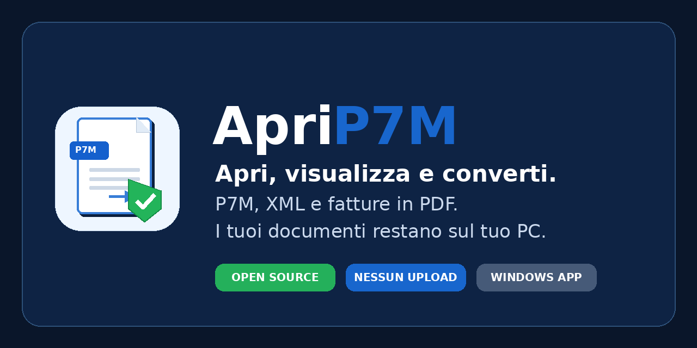
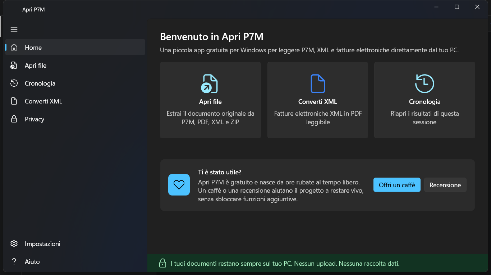

<p align="center">
  
</p>

<h1 align="center">Apri P7M</h1>

<p align="center">
  <strong>Apri, visualizza e converti. Tutto resta sul tuo PC.</strong>
</p>

<p align="center">
  App gratuita per Windows che apre, mostra e converte file <code>.p7m</code>, XML e fatture elettroniche in PDF leggibili — <strong>senza caricare nulla online</strong>.
  <br>
  <strong>Fatto orgogliosamente in Italia 🇮🇹</strong>
</p>

<p align="center">
  <a href="https://apps.microsoft.com/store/detail/9PN10B89Z7LR"></a>
  <a href="https://aprip7m.it"></a>
  <a href="https://github.com/luigiplacidi/ApriP7M/releases/latest"></a>
  
</p>

<p align="center">
  <a href="https://github.com/luigiplacidi/ApriP7M/actions/workflows/build.yml"></a>
  
  
  
</p>

---

## I tuoi documenti restano sul tuo PC

Apri P7M nasce da un problema reale: aprire i file `.p7m` ricevuti via PEC senza
dover installare software complicati, legarsi a un provider di firma digitale o —
peggio — caricare documenti sensibili su siti online.

Apri P7M fa una cosa sola, e la fa bene: **apre il contenitore firmato, estrae il
documento originale e lo rende leggibile**. Tutto in locale, offline, senza
registrazione.

> **I tuoi file restano sul tuo computer. Apri P7M non carica nulla online.**

<p align="center">
  
</p>

## Download

La versione consigliata è quella del **Microsoft Store**: installazione più
semplice, aggiornamenti gestiti da Windows e pacchetto firmato dallo Store.

- **Microsoft Store:** <https://apps.microsoft.com/store/detail/9PN10B89Z7LR>
- **Sito ufficiale:** <https://aprip7m.it>
- **Installer standalone (.exe):**
  <https://github.com/luigiplacidi/ApriP7M/releases/latest/download/Apri.P7M.Setup.x64.exe>
- **Tutte le release:** <https://github.com/luigiplacidi/ApriP7M/releases>

L'installer standalone è una procedura guidata Windows: permette di scegliere la
cartella di installazione, creare il collegamento sul desktop, associare le
estensioni `.p7m` e `.xml`, e avviare l'app al termine. Gli archivi `.zip`
restano apribili dall'app, ma non vengono associati per non sostituire il gestore
ZIP di Windows.

Quando viene pubblicato un nuovo tag `v*`, la pipeline GitHub Release genera e
carica automaticamente gli artefatti ufficiali nella pagina release del progetto.

## Cosa fa

- 📂 Apre file `.p7m`, `.pdf.p7m`, `.xml.p7m`, `.xml` e `.zip`
- 📄 Estrae il documento originale contenuto nel `.p7m`
- 🧾 Converte le fatture elettroniche XML in un **PDF leggibile di cortesia**
- 🗜️ Apre archivi `.zip` con più XML/P7M e relativi allegati
- 💾 Salva il documento originale estratto e il PDF generato
- 👁️ Mostra l'anteprima del risultato
- ⚙️ Permette di gestire dalle impostazioni le associazioni file di Windows
- 🔌 Funziona **completamente offline**

> ℹ️ **Sulle fatture:** il PDF generato è una **copia leggibile di cortesia**.
> Il documento fiscalmente rilevante resta **il file XML originale**.

## Cosa NON fa (per scelta)

Apri P7M **non** firma documenti, **non** verifica la validità legale della firma,
**non** sostituisce i software ufficiali di verifica, **non** invia PEC, **non**
gestisce la conservazione sostitutiva, **non** usa il cloud, **non** richiede login,
**non** ha telemetria automatica, **non** installa servizi in background e **non** parte
con Windows.

Apri P7M apre ed estrae. Per la verifica legale della firma, usa gli strumenti
ufficiali.

## Privacy

La privacy è il cuore del progetto:

- ❌ Nessun upload dei file
- ❌ Nessuna telemetria automatica
- ❌ Nessun tracciamento dei documenti
- ✅ Funzionamento offline
- ✅ File temporanei gestiti e ripuliti
- ✅ Log locali minimizzati — **mai il contenuto dei documenti**

È prevista una funzione **"Diagnostica anonima"**, disattivata di default,
volontaria, manuale e con anteprima di ciò che verrebbe condiviso. Dettagli in
[PRIVACY.md](PRIVACY.md).

## Stack tecnico

| Componente | Tecnologia |
|---|---|
| Runtime | .NET 10 (LTS) |
| UI | WinUI 3 + Windows App SDK 2.2 (Fluent Design, tema chiaro/scuro) |
| CMS / PKCS#7 / CAdES | BouncyCastle (estrazione contenuto, **non** validazione firma) |
| Fattura XML → PDF | XSLT → HTML + QuestPDF |
| Anteprima | WebView2 (solo viewer locale, nessuna rete) |
| Distribuzione | Microsoft Store (MSIX) + installer standalone |

## Struttura del repository

```
src/
  ApriP7M.App/      WinUI 3 — interfaccia, ViewModel, View
  ApriP7M.Core/     Logica pura, senza UI (estrazione P7M, parsing fattura, render)
  ApriP7M.Store/    Integrazione Microsoft Store (aggiornamenti, recensioni)
tests/
  ApriP7M.Core.Tests/
```

## Build

> ⚠️ La build dell'app richiede **Windows 11** con .NET 10 SDK e il workload
> Windows App SDK. La libreria `ApriP7M.Core` è cross-platform e testabile ovunque.

```powershell
dotnet restore
dotnet build -c Release
dotnet test tests/ApriP7M.Core.Tests
```

I test includono le **verifiche delle promesse di prodotto**
([`ProductPromisesTests`](tests/ApriP7M.Core.Tests/ProductPromisesTests.cs)):
nessuna API di rete nella logica, estrazione P7M fedele byte per byte, PDF di
cortesia con l'avviso sul valore fiscale, pulizia dei file temporanei,
diagnostica disattivata di default. Chiunque può eseguirli e controllare.

## Aggiornamenti

Se installi dal **Microsoft Store**, gli aggiornamenti arrivano automaticamente
dal canale normale di Windows. Se usi l'installer standalone, scarica le nuove
versioni solo dal sito ufficiale o dalle release GitHub del progetto.

Le novità di ogni versione sono nel [CHANGELOG](CHANGELOG.md).

## Contribuire

Le contribuzioni sono benvenute — vedi [CONTRIBUTING.md](CONTRIBUTING.md).
Per segnalazioni di sicurezza, [SECURITY.md](SECURITY.md).

## Licenza

Il codice è **source available**: puoi leggerlo, studiarlo, compilarlo per test
personali, proporre modifiche e segnalare problemi. Non è una licenza open source
OSI e non autorizza la redistribuzione commerciale o la pubblicazione di versioni
modificate senza permesso scritto. La vendita dell'app, degli installer, dei
pacchetti o di versioni derivate è vietata senza autorizzazione scritta. Vedi
[LICENSE](LICENSE).

---

<p align="center"><em>Creato per mia moglie. Fatto orgogliosamente in Italia 🇮🇹. Condiviso con chiunque abbia litigato almeno una volta con un file .p7m.</em></p>
